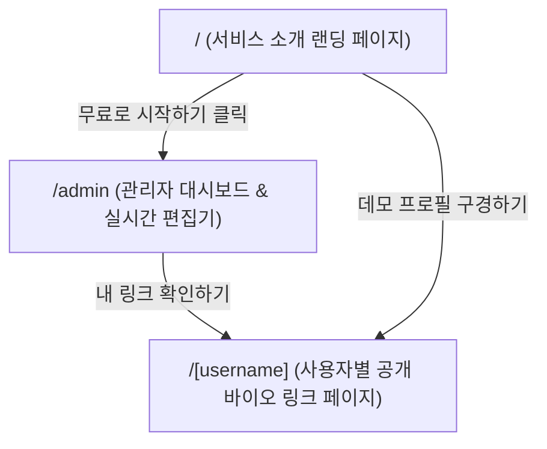

# 📄 제품 요구사항 정의서 (PRD): 마이링크 (MyLink)

> **프로젝트명**: 마이링크 (MyLink)  
> **버전**: v1.0 (MVP)  
> **작성일**: 2026-09-24  
> **작성자**: Antigravity & 김민준 (@mlm577373)  
> **기술 스택**: Next.js 16 (App Router), TypeScript, Tailwind CSS v4, Zustand (전역 상태 관리 & LocalStorage persist)  

---

## 1. 프로젝트 개요 (Overview)

### 1.1 배경 및 목적
- SNS(인스타그램, 유튜브, 틱톡 등) 프로필에 단 하나의 링크만 넣을 수 있는 한계를 극복하고, 크리에이터와 개발자가 자신을 표현하는 모든 링크와 콘텐츠를 모아둘 수 있는 **한국형 모던 바이오 링크(Linktree 클론) 서비스**를 구축합니다.
- 복잡한 외부 인프라 설정 없이도 **즉시 실행하고 테스트할 수 있는 프론트엔드 완결형 프로토타입**으로 출발하며, 향후 Supabase/PostgreSQL 등 실제 백엔드로 손쉽게 확장 가능한 클린 아키텍처를 지향합니다.

### 1.2 핵심 가치 (Value Proposition)
1. **실시간 모바일 프리뷰 편집 경험**: 좌측에서 수정하면 우측 가상 스마트폰 화면에서 딜레이 없이 즉시 반영
2. **트렌디하고 감각적인 디자인 프리셋**: 버튼 하나로 전문가 수준의 프로필 테마 적용
3. **직관적인 링크 관리 및 클릭 분석**: 순서 변경, 공개/비공개 토글, 링크별 클릭 수 실시간 카운팅

---

## 2. 타겟 사용자 및 페르소나 (Target Audience)

- **크리에이터 / 인플루언서**: 유튜브, 인스타그램, 블로그, 오픈채팅방 등 여러 채널을 하나의 예쁜 링크로 묶고 싶은 사용자
- **개발자 / 디자이너**: 깃허브, 포트폴리오, 이력서, 기술 블로그를 깔끔한 링크 카드로 공유하고 싶은 사용자
- **개인 브랜드 및 프리랜서**: 간편하게 자신을 소개하고 이메일/문의 링크를 안내하고 싶은 사용자

---

## 3. 정보 구조 및 라우팅 (Information Architecture)



| 경로 | 명칭 | 주요 역할 |
|---|---|---|
| `/` | 랜딩 페이지 | 서비스 소개, 주요 기능 어필, 데모 체험 링크, '내 마이링크 만들기' CTA 버튼 |
| `/admin` | 관리자 대시보드 | **좌측**: 프로필/링크/테마/통계 편집 폼 <br> **우측**: 실시간 모바일 목업 프리뷰 |
| `/[username]` | 공개 프로필 페이지 | 방문자에게 보여지는 최종 반응형 바이오 링크 페이지 (클릭 수 수집) |

---

## 4. 핵심 기능 요구사항 (Functional Requirements)

### 4.1 관리자 대시보드 (`/admin`)

#### A. 2열 분할 레이아웃 (Split Layout)
- **데스크톱 (lg 이상)**: 좌측 60% (편집 패널) + 우측 40% (모바일 프리뷰 화면 고정 Sticky)
- **모바일/태블릿 (md 이하)**: 상단 탭으로 `[편집]`과 `[미리보기]` 전환 지원

#### B. 프로필 설정 모듈
- **프로필 이미지 / 아바타**: 이미지 URL 입력 또는 감각적인 컬러 이니셜 아바타 자동 생성
- **사용자 이름 (Display Name)**: 화면에 크게 노출되는 대표 이름
- **사용자 ID (Username)**: 고유 URL 슬러그 결정 (예: `/[username]`)
- **한 줄 바이오 (Bio)**: 최대 100자 내외의 짧은 소개 문구

#### C. 링크 관리 (Link Management) CRUD
- **링크 추가/수정/삭제**: 제목(Title), 연결 URL 필수 입력
- **스마트 소셜 아이콘 자동 감지**:
  - 입력된 URL 도메인 분석 (YouTube, GitHub, Instagram, Twitter/X, Mailto, Blog 등) 후 일치하는 소셜 아이콘 및 브랜드 컬러 자동 매칭 (수동 선택도 가능)
- **공개/비공개 토글 (Visibility)**: 스위치 컴포넌트로 링크 임시 숨김 기능
- **순서 변경 (Reordering)**: 위/아래 이동 버튼 또는 드래그 앤 드롭으로 카드 순서 즉각 변경

#### D. 실시간 클릭 수 통계 (Analytics)
- 각 링크 카드마다 **총 누적 클릭 수(Click Count)** 뱃지 표시
- 공개 페이지에서 방문자가 해당 링크를 클릭할 때마다 카운트 1 증가
- 대시보드 상단에 전체 링크의 **총 방문/클릭 수 요약 카드** 제공

#### E. 테마 및 디자인 커스터마이징 (Appearance)
- **6가지 완성형 프리셋 테마 원클릭 적용**:
  1. `Modern Dark`: 딥 네이비 & 인디고 글래스모피즘
  2. `Minimalist Light`: 깔끔하고 단정한 화이트/라이트 그레이
  3. `Aurora Dream`: 몽환적인 핑크-퍼플 그라데이션
  4. `Cyber Neon`: 미래지향적 네온 그린 & 블랙 콘트라스트
  5. `Sunset Warm`: 따뜻한 오렌지-코랄 노을 감성
  6. `Forest Sage`: 차분하고 안정적인 세이지 그린/올리브 톤
- **버튼 스타일 세부 선택**:
  - 형태: `Pill (완전 둥글게)`, `Rounded (살짝 둥글게)`, `Sharp (직각)`
  - 스타일: `Solid (채우기)`, `Soft Glass (반투명 블러)`, `Outline (외곽선)`

---

### 4.2 공개 프로필 페이지 (`/[username]`)

- **초고속 반응형 렌더링**: 모바일 스마트폰 화면 폭(최대 480px)을 기본으로 중앙 정렬
- **링크 클릭 인터랙션**:
  - 카드 클릭 시 새 탭으로 해당 URL 이동
  - 클릭 이벤트 발생 시 비동기로 LocalStorage 클릭 수 카운트 증가
  - 호버 시 부드러운 스케일 업(`hover:scale-[1.02]`) 및 광택 효과
- **상단 공유 기능**:
  - 우측 상단 '공유' 버튼 클릭 시 브라우저 Web Share API 호출 또는 주소 자동 복사 및 토스트 안내
- **하단 브랜딩 푸터**:
  - "나만의 마이링크 만들기" 유도 배너 (랜딩 페이지로 연결)

---

### 4.3 데이터 및 상태 관리 아키텍처 (Zustand)

- **전역 상태 라이브러리**: **`Zustand`** 채택
  - 번들 크기 1KB 미만의 초경량성 및 보일러플레이트 제로
  - `persist` 미들웨어를 활용하여 브라우저 `localStorage`에 자동 영속화
  - 좌측 편집기(Admin Form)와 우측 실시간 모바일 목업(Phone Preview) 간의 **무지연 실시간 렌더링 동기화** 보장

- **데이터 계층 모델 (Data Model)**:
  ```typescript
  export interface LinkItem {
    id: string;
    title: string;
    url: string;
    icon: string;
    isActive: boolean;
    clicks: number;
    order: number;
  }

  export interface UserProfile {
    username: string;
    displayName: string;
    bio: string;
    avatarUrl?: string;
    theme: ThemeKey;
    buttonStyle: ButtonStyle;
    links: LinkItem[];
  }
  ```

- **Zustand 스토어 액션 인터페이스 (`useMyLinkStore`)**:
  - `updateProfile(data: Partial<UserProfile>)`: 프로필 정보 실시간 변경
  - `addLink(link: Omit<LinkItem, 'id' | 'clicks' | 'order'>)`: 새 링크 추가
  - `updateLink(id: string, data: Partial<LinkItem>)`: 링크 수정
  - `deleteLink(id: string)`: 링크 삭제
  - `reorderLinks(startIndex: number, endIndex: number)`: 링크 순서 재배치
  - `toggleLinkActive(id: string)`: 링크 공개/비공개 토글
  - `incrementClick(id: string)`: 특정 링크 클릭 수 증가
  - `setTheme(theme: ThemeKey)`: 테마 실시간 변경
  - `setButtonStyle(style: ButtonStyle)`: 버튼 스타일 변경
  - `resetToDefault()`: 초기 기본 데이터로 리셋

- **초기 시드 데이터**: 기본적으로 `@mlm577373` (김민준) 프로필과 주요 샘플 링크가 풍부하게 채워진 상태로 시작하여 바로 인터랙션 체험 가능

---

## 5. UI/UX 디자인 가이드라인

- **톤앤매너**: 세련됨, 심플함, 감각적인 마이크로 인터랙션
- **모바일 퍼스트(Mobile-First)**: 링크트리 특성상 트래픽의 90% 이상이 모바일이므로 모든 컴포넌트는 모바일 뷰를 최우선으로 검증
- **접근성 및 피드백**:
  - 저장 시 "저장되었습니다" 시각적 피드백 제공 (상태 뱃지 또는 토스트)
  - 입력창 유효성 검사 (올바른 URL 형식 체크)

---

## 6. 개발 로드맵 (Milestones)

### Phase 1: MVP 완성 (현재 범위)
- [x] 프로젝트 초기 환경 구성 (Next.js 16 + Tailwind CSS v4 + TypeScript)
- [ ] Zustand 스토어 및 LocalStorage Persist 연동 (`useMyLinkStore`)
- [ ] 관리자 대시보드 (`/admin`) 좌우 분할 UI 및 링크 CRUD 구현
- [ ] 실시간 모바일 목업 프리뷰 동기화
- [ ] 테마 6종 및 버튼 스타일 셀렉터 구현
- [ ] 공개 프로필 페이지 (`/[username]`) 및 클릭 수 추적 구현
- [ ] 서비스 소개 랜딩 페이지 (`/`) 구현

### Phase 2: 실제 백엔드 연동 (향후 확장)
- Supabase Auth를 통한 이메일 / Google / GitHub 소셜 로그인
- PostgreSQL DB 연동으로 다중 사용자 데이터 영구 저장
- Supabase Storage를 통한 실제 프로필 이미지 업로드
- 클릭 통계 차트 (최근 7일 방문자 추이 그래프)
