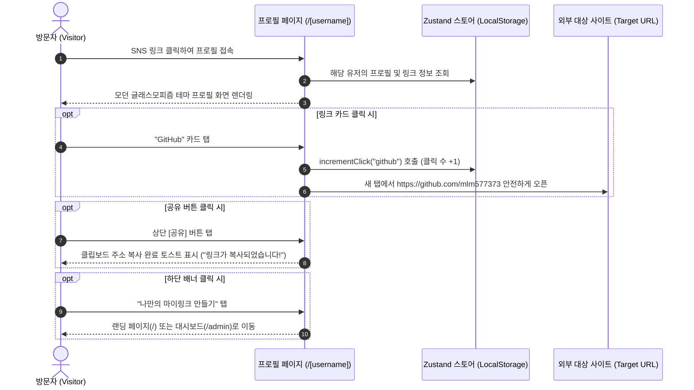

# 📱 마이링크 (MyLink) 메인 화면 와이어프레임 (Wireframe)

본 문서는 방문자 관점에서 경험하게 되는 **두 가지 핵심 메인 화면**의 레이아웃과 UI 컴포넌트 구조를 정의한 와이어프레임입니다:
1. **[화면 1] 방문자용 바이오 링크 공개 프로필 화면 (`/[username]`)** *(SNS 유입 시)*
2. **[화면 2] 서비스 소개 메인 랜딩 페이지 (`/`)** *(일반 웹 방문 시)*

---

## 1. 방문자용 바이오 링크 공개 화면 (`/[username]`)
> **뷰포트 기준**: 모바일 퍼스트 (폭: 390px ~ 430px 기준 중앙 정렬)  
> **핵심 목표**: 직관적인 정보 전달, 감각적인 비주얼, 탭하고 싶은 카드 인터랙션

```text
┌───────────────────────────────────────────────┐
│  [URL] mylink.app/mlm577373         [공유 🔗]  │
├───────────────────────────────────────────────┤
│                                               │
│                 ╭───────────╮                 │
│                 │   (MJ)    │ 🟢              │ ── 1. 프로필 아바타 & 상태
│                 ╰───────────╯                 │    (그라데이션 링 + 활성 뱃지)
│                                               │
│                 김민준                        │ ── 2. 표시 이름 (Display Name)
│              @mlm577373                       │ ── 3. 핸들 (고유 ID 칩)
│                                               │
│      "아이디어를 현실로 만드는 개발 공간 🚀"        │ ── 4. 한 줄 소개 (Bio)
│                                               │
│       [Next.js]  [TypeScript]  [Creative]     │ ── 5. 기술/관심사 태그 칩
│                                               │
│  ───────────────────────────────────────────  │
│                                               │
│  ┌─────────────────────────────────────────┐  │
│  │ [🐱]  GitHub                   [Official]│  │ ── 6. 링크 카드 (Feature Item)
│  │       @mlm577373 • 오픈소스 프로젝트   > │  │    - 왼쪽: 브랜드 아이콘
│  └─────────────────────────────────────────┘  │    - 중앙: 제목 & 서브설명
│                                               │    - 오른쪽: 강조 뱃지 & 화살표
│  ┌─────────────────────────────────────────┐  │
│  │ [💼]  포트폴리오 웹사이트       [Featured]│  │
│  │       최신 프로젝트 & 작업물 모음     > │  │
│  └─────────────────────────────────────────┘  │
│                                               │
│  ┌─────────────────────────────────────────┐  │
│  │ [✉️]  이메일 문의             [Contact]  │  │
│  │       mlm577373@gmail.com             > │  │
│  └─────────────────────────────────────────┘  │
│                                               │
│  ┌─────────────────────────────────────────┐  │
│  │ [📝]  기술 블로그 (준비 중)      [Soon]   │  │
│  │       배운 것을 기록하고 나누는 공간  > │  │
│  └─────────────────────────────────────────┘  │
│                                               │
│  ───────────────────────────────────────────  │
│                                               │
│             [🐱]  [📺]  [📸]  [✉️]             │ ── 7. 퀵 소셜 아이콘 바
│          (GitHub)(YouTube)(Insta)(Mail)       │
│                                               │
│  ┌─────────────────────────────────────────┐  │
│  │      🔗 나만의 마이링크 30초 만에 만들기 >  │  │ ── 8. 바이럴 유도 배너 (CTA)
│  └─────────────────────────────────────────┘  │
│                                               │
│        © 2026 MyLink • Powered by Next.js     │ ── 9. 푸터
└───────────────────────────────────────────────┘
```

### 🔍 주요 컴포넌트 상세 명세 (화면 1)
| 번호 | 컴포넌트 명 | 설명 및 인터랙션 |
|---|---|---|
| **1** | 아바타 & 상태 | 원형 이미지 또는 이니셜 텍스트. 우측 하단 녹색 점(`animate-pulse`)으로 활성 상태 표시 |
| **2~4** | 프로필 헤더 | 이름, 유저네임 뱃지, 감성적인 한 줄 소개 |
| **5** | 태그 칩 | 주요 관심사나 직무를 키워드 형태로 보여주는 미니 태그 |
| **6** | 링크 카드 리스트 | 마우스 오버(Hover) 시 살짝 떠오르는 스케일 업 애니메이션. 터치 시 새 창 열림 + 백그라운드 클릭 수 증가 |
| **7** | 퀵 소셜 아이콘 바 | 하단에 컴팩트하게 배치된 원형 소셜 채널 바로가기 버튼 |
| **8** | 바이럴 배너 | 방문자가 자연스럽게 자신의 링크트리를 만들 수 있도록 랜딩 페이지로 유도하는 CTA |

---

## 2. 서비스 소개 메인 랜딩 페이지 (`/`)
> **뷰포트 기준**: 반응형 웹 (데스크톱 와이드 화면 기준)  
> **핵심 목표**: 서비스 가치 전달, 실시간 목업 데모 시각화, 신규 유저 가입/시작 유도

```text
┌─────────────────────────────────────────────────────────────────────────────┐
│  🔗 마이링크 (MyLink)        [주요 기능]   [테마 둘러보기]        [무료로 시작하기]  │ ── GNB
├─────────────────────────────────────────────────────────────────────────────┤
│                                                                             │
│  [ Hero Section ]                                                           │
│                                                                             │
│   모든 링크를 하나의                       ┌─────────────────────────┐      │
│   감각적인 프로필로 🔗                      │ 📱                      │      │
│                                            │   김민준 (@mlm577373)   │      │
│   인스타그램, 유튜브, 깃허브, 블로그까지.  │   ┌───────────────────┐ │      │
│   30초 만에 나만의 바이오 링크를 만들고    │   │ 🐱 GitHub         │ │      │
│   실시간 클릭 분석을 시작하세요.           │   ├───────────────────┤ │      │
│                                            │   │ 💼 포트폴리오      │ │      │
│   [ 🚀 30초 만에 시작하기 ] [ 📱 데모 구경 ]│   ├───────────────────┤ │      │
│                                            │   │ ✉️ 이메일 문의     │ │      │
│   ⭐️ 100% 무료 • 신용카드 불필요            │   └───────────────────┘ │      │
│                                            └─────────────────────────┘      │
│                                            (실제 동작하는 폰 목업 일러스트)   │
│                                                                             │
├─────────────────────────────────────────────────────────────────────────────┤
│                                                                             │
│  [ Feature Grid : 왜 마이링크인가요? ]                                       │
│                                                                             │
│  ┌──────────────────────┐  ┌──────────────────────┐  ┌────────────────────┐ │
│  │ ⚡ 실시간 모바일 프리뷰│  │ 🎨 6종 감성 프리셋 테마│  │ 📊 실시간 클릭 분석 │ │
│  │ 수정하는 즉시 우측   │  │ 버튼 하나로 오로라,  │  │ 어떤 링크가 인기   │ │
│  │ 폰 화면에 딜레이 없이 │  │ 다크, 네온 등 개성   │  │ 있는지 조회수를    │ │
│  │ 실시간 반영됩니다.   │  │ 있는 디자인 적용     │  │ 실시간으로 추적    │ │
│  └──────────────────────┘  └──────────────────────┘  └────────────────────┘ │
│                                                                             │
├─────────────────────────────────────────────────────────────────────────────┤
│                                                                             │
│  [ Bottom CTA Section ]                                                     │
│                                                                             │
│                  "당신의 모든 것을 하나의 링크에 담아보세요"                  │
│                        [ 지금 무료로 마이링크 만들기 ]                       │
│                                                                             │
├─────────────────────────────────────────────────────────────────────────────┤
│  © 2026 MyLink. Built with Next.js 16, TypeScript & Tailwind CSS.           │
└─────────────────────────────────────────────────────────────────────────────┘
```

---

## 3. 모바일 화면 전환 흐름 (Interaction Flow)


